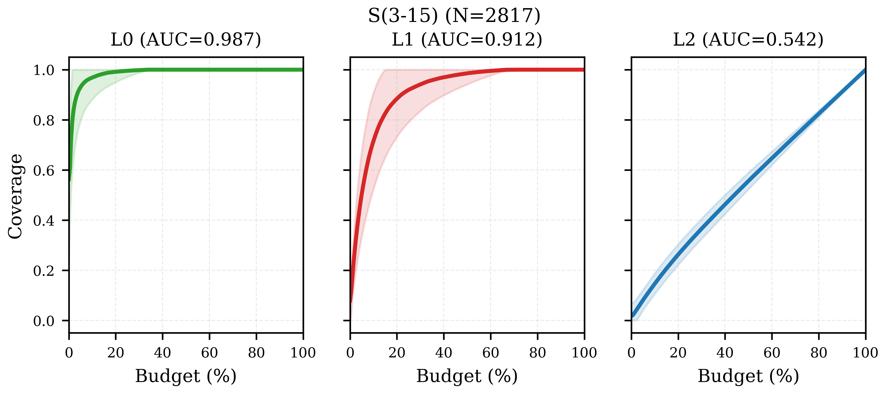
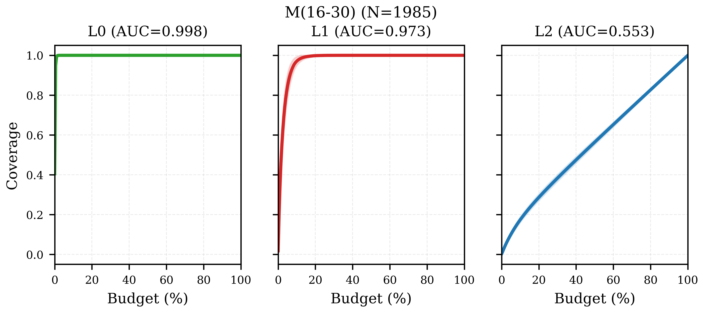
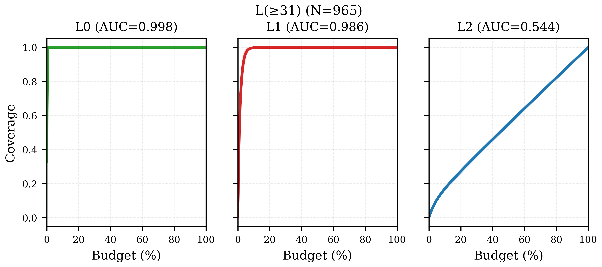
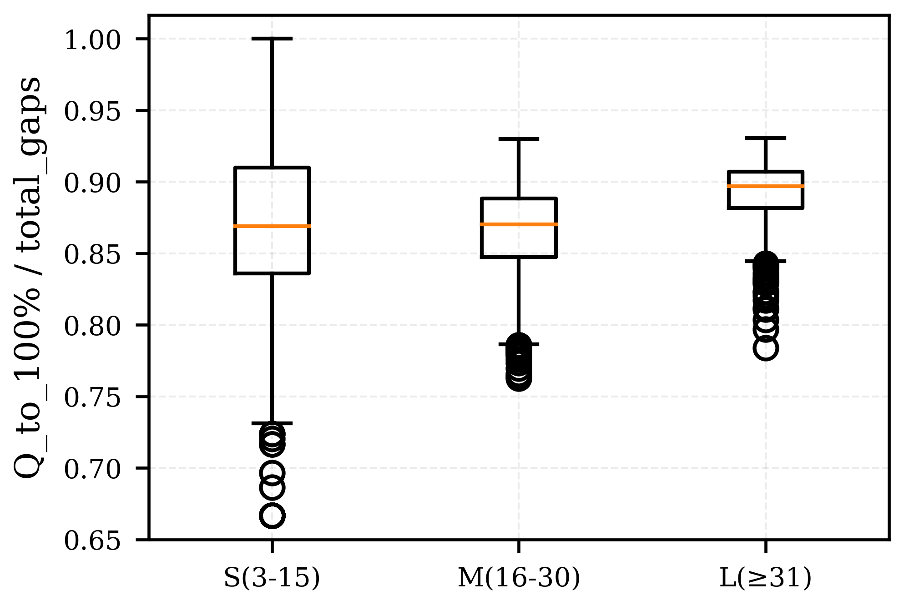
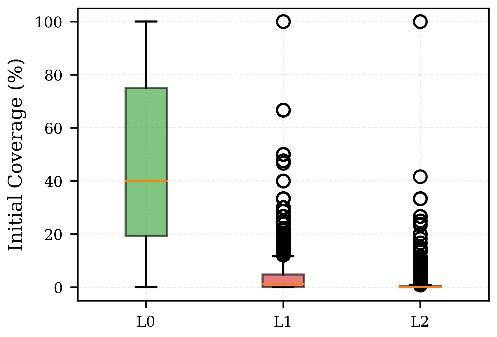
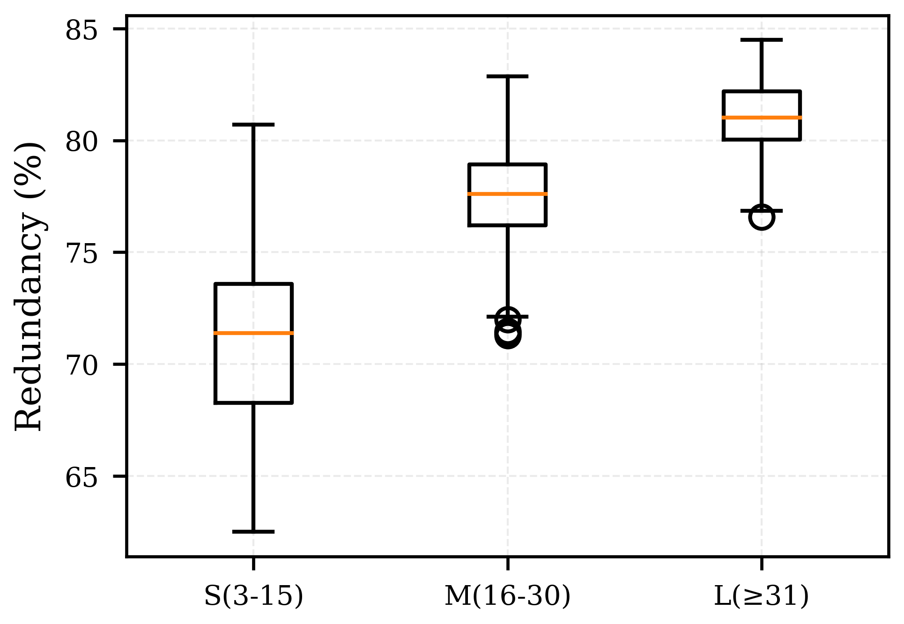
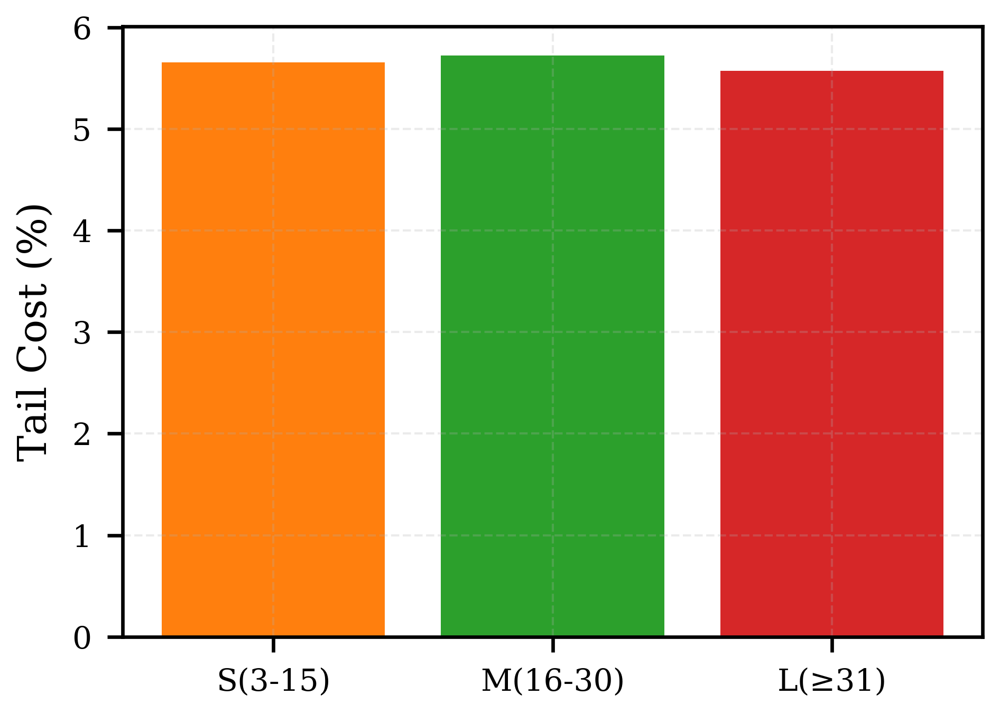

# RQ2 Comprehensive Analysis Report (Fixed)

> Generated: 2026-05-18
> Scope: 5767 valid frames, S/M/L/All groups
> Coverage scope: R1 + R2_backfill (reaches 100% L2)

## D1: Coverage Curves & AUC

**S(3-15)** (N=2817): AUC L0=0.987, L1=0.912, L2=0.542

**M(16-30)** (N=1985): AUC L0=0.998, L1=0.973, L2=0.553

**L(≥31)** (N=965): AUC L0=0.998, L1=0.986, L2=0.544

**All(≥3)** (N=5767): AUC L0=0.993, L1=0.946, L2=0.546

## D2: Coverage Decay (ΔL2/Q by segment)
Using R1+R2_backfill curves (reaches 100%).

| Segment | S(3-15) | M(16-30) | L(≥31) |
|---------|---|---|---|
| 0%-25% | 0.031735 | 0.000484 | 0.000068 |
| 25%-50% | 0.032127 | 0.000307 | 0.000045 |
| 50%-75% | 0.032025 | 0.000280 | 0.000043 |
| 75%-90% | 0.012805 | 0.000276 | 0.000043 |
| 90%-100% | 0.012799 | 0.000274 | 0.000042 |

## D3: Question Type Distribution (Full R1+R2)

| Group | converge | dir_chain | dist_chain | viewpoint | diverge | Total |
|-------|----------|-----------|------------|-----------|---------|-------|
| **S(3-15)** | 27.8% | 29.3% | 23.9% | 18.5% | 0.44% | 3,416,309 |
| **M(16-30)** | 29.3% | 28.3% | 23.5% | 18.8% | 0.08% | 28,810,885 |
| **L(≥31)** | 30.4% | 27.6% | 23.2% | 18.7% | 0.01% | 97,233,943 |
| **All(≥3)** | 30.1% | 27.8% | 23.3% | 18.8% | 0.04% | 129,461,137 |

## D4: Compression Ratio
Q_to_100% / total_L2_gaps (lower = more efficient)

| Group | Median | Mean | P25 | P75 |
|-------|--------|------|-----|-----|
| **S(3-15)** | 0.869 | 0.877 | 0.836 | 0.910 |
| **M(16-30)** | 0.870 | 0.865 | 0.847 | 0.888 |
| **L(≥31)** | 0.897 | 0.893 | 0.882 | 0.907 |
| **All(≥3)** | 0.876 | 0.876 | 0.848 | 0.900 |

## D5: Initial Coverage Distribution

| Group | Init L0 | Init L1 | Init L2 |
|-------|---------|---------|---------|
| **S(3-15)** | 56.3% | 7.9% | 1.8% |
| **M(16-30)** | 40.5% | 1.8% | 0.3% |
| **L(≥31)** | 32.8% | 0.8% | 0.1% |
| **All(≥3)** | 46.9% | 4.6% | 1.0% |

## D6: R1 vs R2 Contribution
R1 coverage uses actual reachable gaps as denominator.

| Group | R1 avg Q | R2_fill avg Q | R1 ΔL2% | R1 end cov (corrected) |
|-------|----------|---------------|---------|------------------------|
| **S(3-15)** | 342.6 | 870.1 | 92.9% | 91.3% |
| **M(16-30)** | 4259.4 | 10254.9 | 96.0% | 95.6% |
| **L(≥31)** | 30662.9 | 70097.7 | 97.8% | 97.4% |
| **All(≥3)** | 6764.3 | 15684.3 | 97.3% | 93.8% |

## D7: Scalability (Q_to_100% vs Nodes)

**Fit**: Q = 10^-0.91 x N^3.36 (R²=0.9971)

## D8: Redundancy (1 - ΣΔL2/Σraw_L2)

| Group | Global | Per-frame mean | Per-frame median |
|-------|--------|----------------|------------------|
| **S(3-15)** | 73.9% | 71.1% | 71.4% |
| **M(16-30)** | 78.4% | 77.6% | 77.6% |
| **L(≥31)** | 81.8% | 81.0% | 81.0% |
| **All(≥3)** | 81.0% | 75.0% | 75.6% |

## D9: Timing (Pipeline Phase Breakdown)

| Group | precompute_ms | plan_cache_ms | selection_ms | total_ms |
|-------|---------------|---------------|--------------|----------|
| **S(3-15)** | 1 | 102 | 29 | 148 |
| **M(16-30)** | 29 | 2074 | 383 | 2648 |
| **L(≥31)** | 389 | 27714 | 2849 | 32016 |
| **All(≥3)** | 76 | 5401 | 623 | 6341 |

## D10: Constraint Quality (R1 only)

Avg constraints/Q: **1.49**
| Type | Count | % |
|------|-------|---|
| ref_dir | 31,030,256 | 100.0% |

## D11: Ego Analysis
Questions involving the ego vehicle.

| Group | Total Q (JSONL) | Ego Q | Ego % |
|-------|-----------------|-------|-------|
| **S(3-15)** | 3,416,309 | 815,094 | 23.9% |
| **M(16-30)** | 28,810,885 | 3,389,616 | 11.8% |
| **L(≥31)** | 97,233,943 | 5,911,446 | 6.1% |
| **All(≥3)** | 129,461,137 | 10,116,156 | 7.8% |

## D12: Graph Density
Complete graph: edges = N*(N-1) directed pairs.

| Group | Avg N | Avg Gaps | Gaps/N | Gaps/N² |
|-------|-------|----------|--------|---------|
| **S(3-15)** | 9.2 | 435 | 36.3 | 3.244 |
| **M(16-30)** | 21.9 | 5127 | 217.1 | 9.510 |
| **L(≥31)** | 40.0 | 35049 | 782.1 | 18.523 |
| **All(≥3)** | 18.7 | 7842 | 223.3 | 7.958 |

## D13: Answer Type Distribution

| Type | Count | % |
|------|-------|---|
| choice | 54,417,627 | 42.0% |
| object | 38,959,695 | 30.1% |
| boolean | 36,083,815 | 27.9% |

## D14: Candidate Filtering

Note: candidate_before/after = 0 in JSONL (constraints applied in plan_cache phase, not per-question).

## D15: Cross-frame Gap Overlap

Avg frame coverage of scene gap union: **13.5%**
(Each frame covers ~13.5% of its scene's unique gaps)

## D16: Coverage Saturation (95%→100% tail cost)
Using R1+R2_backfill curves.

| Group | Avg Q_to_95% | Avg Q_95%→100% | Tail % |
|-------|--------------|----------------|--------|
| **S(3-15)** | 352 | 21 | 5.7% |
| **M(16-30)** | 4209 | 256 | 5.7% |
| **L(≥31)** | 29681 | 1751 | 5.6% |
| **All(≥3)** | 6588 | 391 | 5.6% |

