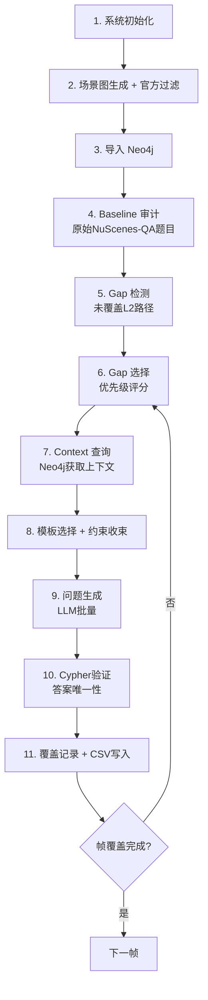

# ADVTEST 项目理解报告

## 一、项目定位

基于 **nuScenes 自动驾驶数据集** 的 **VQA（Visual Question Answering）问题自动生成系统**。核心目标是：

1. 从 nuScenes 的 ~6000 帧数据中，为每一帧构建**场景图（Scene Graph）**
2. 将场景图导入 **Neo4j 图数据库**
3. 分析原有 NuScenes-QA 数据集的题目（baseline），统计其对场景图的**拓扑覆盖**
4. 对未覆盖的拓扑结构（gaps），**自动生成新的 VQA 问答对**，实现 100% 拓扑覆盖
5. 生成过程采用 **LLM + 约束迭代** 确保答案唯一性

---

## 二、核心概念：三层拓扑覆盖 (L0/L1/L2)

| 层级 | 含义 | Key 格式 | 示例 |
|------|------|----------|------|
| **L0** | 节点 | `node_id` | `ego`, `car1`, `pedestrian2` |
| **L1** | 两节点之间的边 | `src→tgt`（无向规范化） | `ego→car1` |
| **L2** | 三节点二连边路径 | `A→B→C`（无向规范化） | `ego→car1→car2` |

> [!IMPORTANT]
> **2026-04 修订**：L2 不再区分 L2A（ego起点）/ L2B（非ego起点），统一为 L2。代码中已实现，但仍有部分历史引用未清理。

### 级联更新规则
- L2 命中 → 同时更新 L1(A→B)、L1(B→C)、L0(A,B,C)
- L1 命中 → 同时更新 L0(src, tgt)
- L0 命中 → 仅更新该节点

---

## 三、项目目录结构

```
E:\Project\ADVTEST\DATA_new\
├── build/
│   └── design(1).md              ← 核心设计文档（18个模块详细设计）
├── code/                         ← 核心代码目录
│   ├── official_pipeline/        ← 主流水线代码
│   │   ├── run_method_a.py       ← 主入口（2747行，闭环执行链）
│   │   ├── run_gap_pipeline_v6.py ← Gap pipeline V6
│   │   ├── core_universe_filter.py ← 场景图过滤（官方标准）
│   │   ├── gap_pipeline/         ← 核心子模块
│   │   │   ├── coverage_tracker.py ← 三层覆盖引擎（774行）
│   │   │   ├── template_library.py ← 模板库（137K）
│   │   │   ├── constraint_methods.py ← 约束方法（60K）
│   │   │   ├── llm_client.py     ← LLM客户端（60K）
│   │   │   └── config.py         ← 配置
│   │   └── deploy/               ← 部署配置（三服务器分工）
│   ├── vqa_pipeline/             ← 另一套VQA pipeline
│   │   ├── config.py, pipeline.py
│   │   ├── gap_templates.py, gap_qa_generator.py
│   │   └── ...
│   └── *.md                      ← 各种文档和进度报告
├── filtered_scene_graphs/        ← 过滤后的场景图JSON
├── data/                         ← nuScenes 数据
└── generated_qa/                 ← 生成的QA输出
```

---

## 四、完整流水线流程



### 关键步骤详解

**Step 1-3: 初始化**
- 加载环境配置、验证 nuScenes 数据、检查 Neo4j/LLM 连通性
- 从 nuScenes 读帧数据，按官方标准过滤（距离30/40/50m、可见度≥40%、像素高度≥10px）
- 过滤后构建完全图导入 Neo4j

**Step 4: Baseline 审计**
- 读取该帧的 NuScenes-QA 原始题目（~29题/帧）
- LLM 将每题转为 Cypher 查询 → 执行 → 提取覆盖的 L0/L1/L2
- 写入 `raw_coverage` 表

**Step 5-6: Gap 选择**
- 优先级评分：`priority = uncovered_L0 × 10 + uncovered_L1 × 15`
- 自适应策略：80% 高优先级 + 20% 随机

**Step 7-11: 问题生成与约束**
- 为选中的 gap 查询 Neo4j 获取上下文（siblings、referents）
- 从模板库选择适用模板，通过约束链（TypeFilter、DirectionFilter等）唯一化答案
- LLM 批量生成问题 → Cypher 验证 → 记录覆盖 → 写入 CSV
- 约束失败时降级为数数/存在问题

---

## 五、当前实现状态

### 已实现 ✅
- 核心流水线可以端到端跑通（`run_method_a.py`）
- 三层覆盖引擎（`coverage_tracker.py`）含无向边规范化
- 官方��景图过滤（已移除错误的 custom20m 模式）
- LLM 批量调用 + 线程池并行
- 模板库 + 约束方法体系
- 覆盖真实性增强（candidates/referents 记录）
- 多服务器部署配置（三台服务器分工）
- CSV/Excel 批量写入

### 未完成 / 待改进 ⚠️
- **断点续传**：部分实现（`restore_from_csv`），但不完善
- **L2A/L2B 残留引用**：约 197 处代码引用需更新
- **数据一致性保障**：缺少原子写入、校验机制
- **结构化日志**：基本日志框架存在但不够结构化
- **完整流程与 design 对齐**：design 文档定义了 18 个模块的详细接口，现有代码对齐程度有限

---

## 六、之前的 Plans 总结

### Plan 1: VQA系统设计审查报告
- 系统性审查了 11 个模块的遗漏点
- 优先级排序：P0（断点续传、数据一致性、LLM重试、Neo4j连接管理）→ P1 → P2 → P3

### Plan 2: 批量问题生成超时修复
- 问题：V16 批量请求 180s 超时
- 解决：减小 `VQA_Q_LLM_CHUNK_SIZE` 从 32 到 16
- 附带发现：Baseline L2 仍为 0、Context hints 全零

### Plan 3: 场景图过滤标准实施
- 问题：72 节点 vs 官方过滤后 7 节点，L2 路径爆炸
- 解决：移除 custom20m 模式，集成官方过滤
- 预期效果：节点减少 90%，边减少 98%，L2 减少 99.5%

---

## 七、Design 文档与现有代码的差距

design(1).md 定义了 **18 个模块** 的详细函数接口。关键差距：

| 设计模块 | 现有实现 | 对齐程度 |
|---------|---------|---------|
| M1: 系统初始化 | `preflight_check()` in run_method_a.py | ⚠️ 部分 |
| M2: 场景图生成 | `generate_selected_scenes_improved.py` | ⚠️ 部分 |
| M3: 导入+缺口初始化 | `import_filtered_sg_to_neo4j()` + `CoverageTracker` | ✅ 较好 |
| M4: 原始题分析 | `step4_baseline_audit()` | ✅ 较好 |
| M5: Gap选择策略 | `select_gaps_with_priority()` | ✅ 较好 |
| M6: 问题生成 | `template_library.py` | ✅ 较好 |
| M7: 约束与答案 | `constraint_methods.py` | ✅ 较好 |
| M8: 生成题保存 | `csv_writer.py` / Excel | ⚠️ 部分 |
| M9: 帧级循环 | run_method_a.py 内联 | ⚠️ 部分 |
| M10: 全局主流程 | run_method_a.py（单帧硬编码） | ❌ 缺失多帧循环 |
| M11: 批处理优化 | ThreadPoolExecutor | ⚠️ 部分 |
| M12: 错误处理 | 基本 try/except | ❌ 缺少系统性设计 |
| M13: 断点续传 | `restore_from_csv` 简单版 | ❌ 不完善 |
| M14: 日志与监控 | 基本 logging | ❌ 缺结构化 |
| M15: 数据一致性 | 无 | ❌ 缺失 |
| M16: 边界情况 | 部分处理 | ⚠️ 部分 |
| M17: 配置管理 | env 文件 + config.py | ⚠️ 部分 |
| M18: 测试与验证 | 少量测试脚本 | ❌ 不完善 |

---

## 八、关键技术栈

- **数据库**: Neo4j（图数据库）+ Cypher 查询语言
- **LLM**: Qwen3.5-35B-A3B（通过 API 调用）
- **数据集**: nuScenes v1.0-trainval（约 6000 帧）
- **语言**: Python 3
- **依赖**: neo4j-driver, openpyxl, openai-compatible API
- **部署**: 3 台 Ubuntu 服务器 + 1 台 Windows 本地
